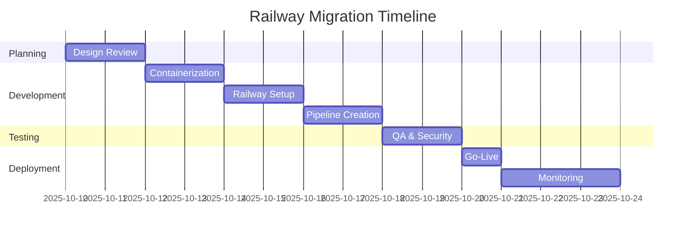

# Railway.com Docker Migration Plan
## travissutphin.com → railways.com

**Document Version**: 1.0
**Date**: October 10, 2025
**Owner**: [Flow] (DevOps Lead)
**Contributors**: [Gordon], [Syntax], [Sentinel], [Verity]
**Methodology**: Team Software Process (TSP)

---

## Executive Summary

This document outlines the comprehensive plan for migrating travissutphin.com from a local XAMPP environment to Railway.com using Docker containerization. The migration will transform our PHP-based personal site into a cloud-native, scalable application while maintaining all existing functionality.

### Migration Goals
1. **Containerize** the existing PHP application using Docker
2. **Deploy** to Railway.com cloud platform
3. **Maintain** zero downtime during transition
4. **Improve** deployment automation and scalability
5. **Ensure** security and performance parity or improvement

---

## 1. Current State Analysis

### 1.1 Existing Architecture
- **Server**: XAMPP (Apache/PHP)
- **Port**: 80 (local)
- **PHP Version**: 8+
- **Database**: None (file-based)
- **CSS Framework**: Tailwind (CDN)
- **Content**: Markdown files (Parsedown)
- **Structure**: MVC-like PHP templates

### 1.2 Project Components
```
/travissutphin.com
├── /public          # Web root (DocumentRoot)
├── /content         # Markdown content files
├── /templates       # PHP view templates
├── /lib            # Core PHP functions
├── /docs           # Documentation
├── /automation     # CI/CD scripts
└── config.php      # Application configuration
```

### 1.3 Dependencies
- PHP 8.2+
- Apache mod_rewrite
- Parsedown library
- No external database dependencies
- CDN-based assets (Tailwind CSS)

---

## 2. Target State Architecture

### 2.1 Docker Container Strategy
```yaml
Services:
  - Web Container (PHP-Apache)
    - Base: php:8.2-apache
    - Includes: mod_rewrite, necessary PHP extensions
    - Volume mounts for content updates
```

### 2.2 Railway.com Configuration
- **Platform**: Railway.com PaaS
- **Deployment**: Git-based with Dockerfile
- **Domain**: railways.com (custom domain)
- **SSL**: Automatic via Railway
- **Environment**: Production

---

## 3. Migration Components

### 3.1 Dockerfile Creation
```dockerfile
# Base configuration
FROM php:8.2-apache

# Enable Apache modules
RUN a2enmod rewrite

# Install dependencies
RUN docker-php-ext-install opcache

# Copy application
COPY . /var/www/html/

# Set document root
ENV APACHE_DOCUMENT_ROOT /var/www/html/public

# Configure Apache
RUN sed -ri -e 's!/var/www/html!${APACHE_DOCUMENT_ROOT}!g' /etc/apache2/sites-available/*.conf
RUN sed -ri -e 's!/var/www/!${APACHE_DOCUMENT_ROOT}!g' /etc/apache2/apache2.conf /etc/apache2/conf-available/*.conf

# Set permissions
RUN chown -R www-data:www-data /var/www/html

EXPOSE 80
```

### 3.2 Docker Compose (Local Testing)
```yaml
version: '3.8'
services:
  web:
    build: .
    ports:
      - "8080:80"
    volumes:
      - ./content:/var/www/html/content
      - ./public:/var/www/html/public
    environment:
      - ENV=development
```

### 3.3 Railway Configuration Files

#### railway.json
```json
{
  "$schema": "https://railway.app/railway.schema.json",
  "build": {
    "builder": "DOCKERFILE"
  },
  "deploy": {
    "restartPolicyType": "ON_FAILURE",
    "restartPolicyMaxRetries": 3
  }
}
```

#### .dockerignore
```
.git
.gitignore
*.md
.claude
docs/
automation/
serve.*
CLAUDE.md
```

---

## 4. Implementation Plan (TSP Phases)

### Phase 1: Planning & Design (Days 1-2)
**Team**: [Flow], [Gordon], [Syntax]

- [ ] Review and finalize migration plan
- [ ] Create risk assessment matrix
- [ ] Establish rollback procedures
- [ ] Define success metrics
- [ ] Schedule team checkpoints

### Phase 2: Local Containerization (Days 3-4)
**Team**: [Flow], [Syntax]

- [ ] Create Dockerfile
- [ ] Build Docker image locally
- [ ] Test with docker-compose
- [ ] Validate all routes and functionality
- [ ] Performance benchmarking

### Phase 3: Railway Setup (Days 5-6)
**Team**: [Flow], [Sentinel]

- [ ] Create Railway account/project
- [ ] Configure environment variables
- [ ] Set up custom domain (railways.com)
- [ ] Configure SSL certificates
- [ ] Set up monitoring and alerts

### Phase 4: Deployment Pipeline (Days 7-8)
**Team**: [Flow], [Syntax]

- [ ] Create GitHub Actions workflow
- [ ] Set up staging environment
- [ ] Configure automated deployments
- [ ] Implement health checks
- [ ] Document deployment process

### Phase 5: Migration & Testing (Days 9-10)
**Team**: [Verity], [Flow], [Sentinel]

- [ ] Deploy to staging
- [ ] Complete QA testing checklist
- [ ] Security audit
- [ ] Performance testing
- [ ] Load testing

### Phase 6: Go-Live (Day 11)
**Team**: [Flow], [Sentinel], [Verity]

- [ ] DNS cutover preparation
- [ ] Deploy to production
- [ ] Monitor initial traffic
- [ ] Verify all functionality
- [ ] Update documentation

### Phase 7: Post-Migration (Days 12-14)
**Team**: [Flow], [Verity]

- [ ] Monitor for 72 hours
- [ ] Performance optimization
- [ ] Team retrospective
- [ ] Documentation updates
- [ ] Knowledge transfer

---

## 5. Risk Assessment & Mitigation

| Risk | Probability | Impact | Mitigation Strategy |
|------|------------|---------|-------------------|
| Docker build failures | Low | High | Extensive local testing, fallback Dockerfile |
| Performance degradation | Medium | Medium | Benchmark testing, optimization phase |
| DNS propagation delays | Medium | Low | Maintain both environments temporarily |
| SSL certificate issues | Low | Medium | Railway automatic SSL, backup cert ready |
| Content path issues | Medium | High | Thorough path testing, volume mapping validation |
| Environment variable mismatch | Low | Medium | Configuration audit, staging validation |

---

## 6. Security Considerations

### 6.1 Container Security
- Use official PHP base image
- Regular security updates
- Minimal attack surface
- No unnecessary packages

### 6.2 Runtime Security
- Read-only root filesystem where possible
- Non-root user execution
- Environment variable management
- Secrets management via Railway

### 6.3 Network Security
- HTTPS enforcement
- Security headers configuration
- Rate limiting implementation
- DDoS protection via Railway

---

## 7. Performance Optimization

### 7.1 Docker Optimizations
- Multi-stage builds
- Layer caching
- OPcache configuration
- Asset optimization

### 7.2 Railway Optimizations
- Auto-scaling configuration
- CDN integration
- Caching strategies
- Database connection pooling (future)

---

## 8. Testing Strategy

### 8.1 Unit Testing
- PHP syntax validation
- Route testing
- Template rendering tests

### 8.2 Integration Testing
- End-to-end user flows
- Content delivery verification
- External service integration

### 8.3 Performance Testing
- Load testing with Apache Bench
- Response time benchmarks
- Resource utilization monitoring

### 8.4 Security Testing
- OWASP compliance check
- Vulnerability scanning
- Penetration testing basics

---

## 9. Rollback Plan

### Immediate Rollback (< 1 hour)
1. Revert DNS to original hosting
2. Restore XAMPP service
3. Notify team via emergency channel

### Delayed Rollback (1-24 hours)
1. Maintain Railway deployment
2. Fix critical issues
3. Re-test thoroughly
4. Schedule re-deployment

---

## 10. Success Metrics

### Technical Metrics
- **Uptime**: > 99.9%
- **Response Time**: < 200ms (p95)
- **Build Time**: < 5 minutes
- **Deployment Time**: < 2 minutes

### Business Metrics
- **User Experience**: No degradation
- **SEO Impact**: Maintain or improve
- **Cost**: Within budget constraints
- **Team Satisfaction**: Positive feedback

---

## 11. Documentation Requirements

### 11.1 Technical Documentation
- [ ] Dockerfile documentation
- [ ] Environment variable reference
- [ ] Deployment procedures
- [ ] Troubleshooting guide

### 11.2 Operational Documentation
- [ ] Monitoring setup
- [ ] Alert configuration
- [ ] Backup procedures
- [ ] Disaster recovery plan

### 11.3 Team Documentation
- [ ] Knowledge base articles
- [ ] Video walkthroughs
- [ ] Runbook creation
- [ ] FAQ compilation

---

## 12. Timeline & Milestones



---

## 13. Team Assignments

| Phase | Primary Lead | Support Team | Duration |
|-------|-------------|--------------|----------|
| Planning | [Gordon] | [Flow], [Syntax] | 2 days |
| Containerization | [Flow] | [Syntax] | 2 days |
| Railway Setup | [Flow] | [Sentinel] | 2 days |
| Pipeline | [Syntax] | [Flow] | 2 days |
| Testing | [Verity] | [Sentinel], [Flow] | 2 days |
| Go-Live | [Flow] | [Sentinel], [Verity] | 1 day |
| Monitoring | [Sentinel] | [Flow], [Verity] | 3 days |

---

## 14. Budget Estimation

### Railway.com Costs
- **Hobby Plan**: $5/month (initial)
- **Pro Plan**: $20/month (if scaling needed)
- **Custom Domain**: Included
- **SSL Certificate**: Included

### Time Investment
- **Total Hours**: ~80 hours
- **Team Members**: 5
- **Duration**: 14 days

---

## 15. Approval & Sign-off

| Role | Name | Date | Signature |
|------|------|------|-----------|
| Product Owner | [Travis] | _______ | _______ |
| Tech Lead | [Syntax] | _______ | _______ |
| DevOps Lead | [Flow] | _______ | _______ |
| Security Lead | [Sentinel] | _______ | _______ |
| QA Lead | [Verity] | _______ | _______ |

---

## Appendices

### A. Configuration Templates
- Dockerfile template
- docker-compose.yml template
- railway.json template
- GitHub Actions workflow

### B. Testing Checklists
- Pre-deployment checklist
- Post-deployment verification
- Security audit checklist
- Performance benchmarks

### C. Emergency Contacts
- Railway support
- DNS provider
- Team emergency contacts
- Escalation matrix

### D. References
- [Railway Documentation](https://docs.railway.app)
- [Docker PHP Best Practices](https://docs.docker.com/language/php/)
- [TSP Guidelines](https://www.sei.cmu.edu/our-work/tsp/)
- Internal documentation links

---

**Document Status**: DRAFT
**Next Review**: Before Phase 1 execution
**Distribution**: [TechTeam], [DeploymentTeam], [Travis]