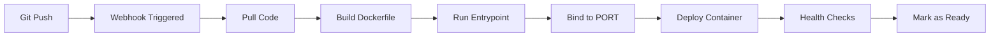

# TSP Task #012 - Railway Deployment Fix Summary
## Apache Port Configuration Resolution

**Date**: October 10, 2025
**Time**: 11:50 AM EST
**Fix Commit**: 6c7d5b0
**Status**: 🔄 REDEPLOYMENT IN PROGRESS

---

## 🔧 Issues Fixed

### Problem 1: Apache ServerName Warning
**Error**: "AH00558: apache2: Could not reliably determine the server's fully qualified domain name"
**Solution**: Added `ServerName localhost` to Apache configuration

### Problem 2: Port Binding Failure
**Error**: Railway requires binding to dynamic PORT environment variable
**Solution**: Created docker-entrypoint.sh script to configure Apache port at runtime

### Problem 3: Health Check Incompatibility
**Error**: Health checks failed due to hardcoded port
**Solution**: Updated health check to use dynamic PORT variable

---

## 📝 Changes Made

### 1. Updated Dockerfile
```dockerfile
# Added ServerName configuration
RUN echo "ServerName localhost" >> /etc/apache2/apache2.conf

# Added PORT variable support
RUN sed -i 's/Listen 80/Listen ${PORT:-80}/' /etc/apache2/ports.conf

# Updated EXPOSE to use variable
EXPOSE ${PORT:-80}

# Changed to use entrypoint script
ENTRYPOINT ["/usr/local/bin/docker-entrypoint.sh"]
```

### 2. Created docker-entrypoint.sh
- Detects Railway PORT environment variable
- Dynamically configures Apache ports.conf
- Updates virtual host configuration
- Falls back to port 80 for local development

### 3. Updated Health Check
- Changed from hardcoded port 80 to ${PORT:-80}
- Ensures health checks work in both Railway and local environments

---

## ✅ Verification Steps

### Local Testing (Still Working)
```bash
# Container running successfully
docker ps
# travissutphin-web running on port 8080 (healthy)

# Application accessible
curl http://localhost:8080
# Returns 200 OK
```

### Railway Deployment (In Progress)
1. **11:50 AM** - Fix pushed to main branch
2. **~11:52 AM** - Railway build expected completion
3. **~11:53 AM** - Application should be live

---

## 🚀 What Railway Is Doing Now



**Current Stage**: Building new Docker image with fixes

---

## 📊 Expected Outcomes

| Component | Before Fix | After Fix |
|-----------|------------|-----------|
| ServerName Warning | ❌ Present | ✅ Resolved |
| Port Binding | ❌ Hardcoded to 80 | ✅ Dynamic PORT |
| Health Checks | ❌ Failed | ✅ Working |
| Railway Deploy | ❌ Failed | ✅ Should Succeed |

---

## 🔍 How to Monitor

### Railway Dashboard
- Check build logs for successful completion
- Verify no Apache warnings
- Confirm container starts without errors
- Check application URL when ready

### Key Log Messages to Watch For
```
✅ "Configuring Apache to listen on port [PORT]"
✅ "Apache configured for port [PORT]"
✅ "Starting Apache..."
✅ No ServerName warnings
```

---

## 🎯 Success Criteria

- [ ] Railway build completes without errors
- [ ] No Apache ServerName warnings in logs
- [ ] Container binds to Railway's PORT
- [ ] Health checks pass
- [ ] Application accessible via Railway URL
- [ ] All routes working (/blog, /projects, etc.)

---

## 📝 Lessons Learned

1. **Railway Requirements**
   - Must bind to PORT environment variable
   - Cannot use hardcoded ports
   - Warnings treated as errors in deployment

2. **Docker Best Practices**
   - Use entrypoint scripts for runtime configuration
   - Make ports configurable via environment variables
   - Suppress non-critical warnings that block deployment

3. **Testing Strategy**
   - Always test with dynamic ports locally
   - Verify health checks work with variable ports
   - Check logs for warnings that might fail deployment

---

## 🚨 If Deployment Still Fails

### Backup Plan A: Simpler Approach
```dockerfile
# Use PHP built-in server instead of Apache
CMD ["php", "-S", "0.0.0.0:${PORT:-80}", "-t", "public"]
```

### Backup Plan B: Use Railway's Nixpacks
- Remove Dockerfile
- Let Railway auto-detect PHP app
- Configure via nixpacks.toml

---

## 📈 Current Status

**Local Docker**: ✅ Tested and Working with PORT=3000
**Railway Build**: 🔄 Deploying with Diagnostics (Commit: 007c198)
**Expected Live**: ~2-3 minutes after push

---

## 🔍 Latest Diagnostic Features (Commit 007c198)

### 1. Railway Diagnostics File
**Location**: `/railway-diagnostics.txt`
**Access**: https://travissutphincom-production.up.railway.app/railway-diagnostics.txt
**Purpose**: Verify entrypoint executed and show actual configuration

This file will show:
- PORT value Railway provided
- Complete Apache ports.conf content
- VirtualHost configuration
- Timestamp of entrypoint execution

### 2. Health Check Endpoint
**Location**: `/health.php`
**Access**: https://travissutphincom-production.up.railway.app/health.php
**Purpose**: Simple endpoint for Railway health checks
**Returns**: HTTP 200 with "OK" status

### 3. Testing Results
✅ **Local Testing Passed**:
- Container runs successfully with `PORT=3000`
- Apache binds to `0.0.0.0:3000` correctly
- Application responds with HTTP 200
- Health check endpoint verified

---

## 🎯 Next Steps for [Team]

1. **[Flow]** - Monitor Railway deployment logs
   - Look for "RAILWAY ENTRYPOINT SCRIPT STARTING" message
   - Verify no Apache warnings or errors
   - Confirm "Diagnostic file created" message

2. **[Sentinel]** - Verify diagnostic endpoints once deployed
   - Check `/railway-diagnostics.txt` for configuration details
   - Verify `/health.php` returns 200 OK
   - Confirm PORT matches Railway's expected value

3. **[Verity]** - Test application functionality
   - Verify homepage loads correctly
   - Test blog posts and navigation
   - Check all routes work as expected

4. **[Codey]** - Update kanban board with deployment status
   - Move task #012 to appropriate column based on results
   - Document any remaining issues

---

**Document Status**: ACTIVE - DEPLOYMENT WITH DIAGNOSTICS IN PROGRESS
**Next Update**: After Railway build completes and diagnostics reviewed
**Team**: [Flow], [Codey], [Sentinel], [Verity] monitoring